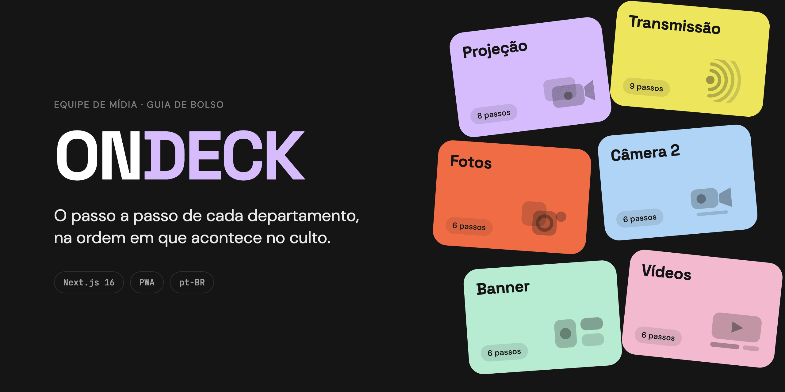
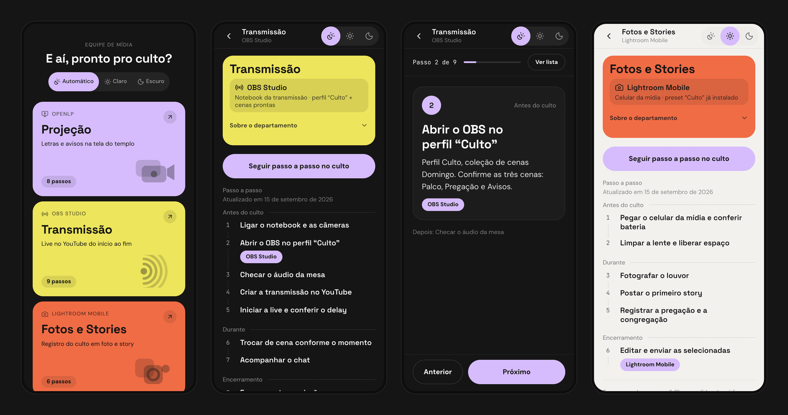
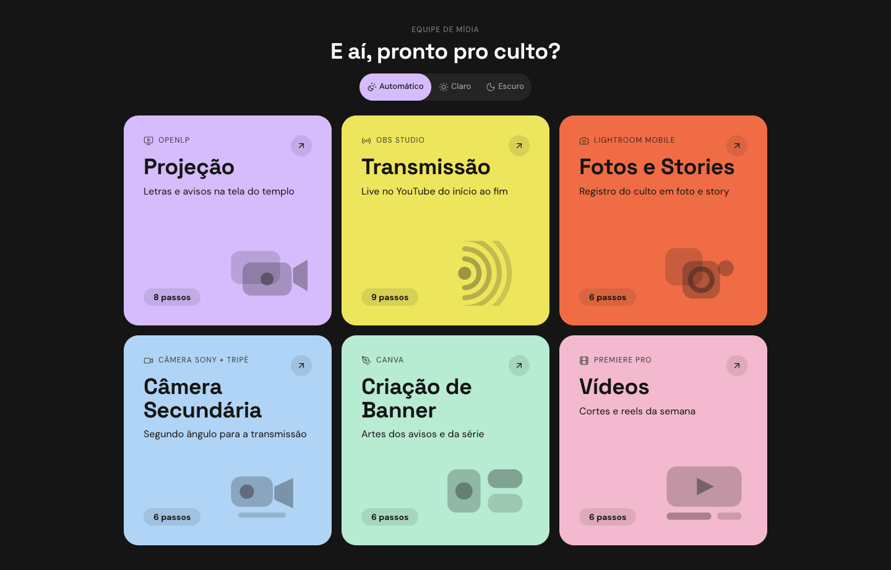

<p align="center">
  
</p>

<p align="center">
  <a href="https://nextjs.org"></a>
  <a href="https://react.dev"></a>
  <a href="https://www.typescriptlang.org"></a>
  <a href="https://tailwindcss.com"></a>
  <a href="https://vitest.dev"></a>
  
</p>

# OnDeck

**A pocket guide for a church's media team.** Volunteers on projection, livestream, photos and stories, secondary camera, banner design and video editing open OnDeck on their phone and follow their role's step-by-step, in the exact order it happens — from before the service starts to after it ends.

It exists for two moments: **someone new joins the team**, and **someone has to cover a role that isn't theirs** minutes before a service, in a dim room, with one hand free. Nothing to log into, nothing to search — pick your department and read.

> The app's interface is in Brazilian Portuguese. The codebase and documentation are in English.

<p align="center">
  
</p>

<p align="center"><sub>Home · List mode · Focus mode · Light theme</sub></p>

## Features

- **Six departments, one tap away.** Each has its own colour and shape, so a volunteer recognises their card without reading.
- **Two ways to read a runbook.**
  - **List mode** — every step as a title, grouped under *Antes do culto*, *Durante* and *Encerramento*, for finding "which step was it?" fast.
  - **Focus mode** — one step per screen with its full detail, large type and controls docked where a thumb already is, for doing the work live.
- **Nothing to set up.** No accounts, no login, no personal data. Nothing about a volunteer's progress is stored.
- **Light, dark or automatic.** Follows the phone by default; a manual choice sticks and is applied before the first paint, so there is no flash.
- **Installable.** Add it to the home screen on Android and iOS; Home offers to install and explains the Share gesture on iPhone.
- **Accessible.** Real ordered lists that keep step numbers for screen readers, a proper dialog on first visit, and reduced motion respected everywhere.

<p align="center">
  
</p>

## Tech stack

| | |
|---|---|
| Framework | [Next.js 16](https://nextjs.org) (App Router), [React 19](https://react.dev), TypeScript |
| Styling | [Tailwind CSS 4](https://tailwindcss.com) over the OnDeck design system's CSS tokens |
| Motion | React view transitions for navigation, [Motion](https://motion.dev) for in-page animation |
| Content | Typed TypeScript validated with [Zod](https://zod.dev) at build time |
| Icons | [Lucide](https://lucide.dev) |
| Tests | [Vitest](https://vitest.dev) with [Testing Library](https://testing-library.com) and jsdom |

Every page is statically prerendered — there is no server, database or API at runtime.

## Getting started

Requires **Node.js 20.9 or later**; the repository pins Node 24 in `.nvmrc`.

```bash
nvm use          # Node 24
npm install
npm run dev      # http://localhost:3000
```

| Command | What it does |
|---|---|
| `npm run dev` | Development server |
| `npm run build` | Production build (prerenders every department) |
| `npm start` | Serve the production build |
| `npm test` | Run all tests once |
| `npm run test:watch` | Tests in watch mode |
| `npm run lint` | ESLint |

> **If tests fail with "Cannot find native binding"** after adding a dependency, npm has dropped an optional native package ([npm/cli#4828](https://github.com/npm/cli/issues/4828)). Reinstall cleanly: `rm -rf node_modules package-lock.json && npm install`.

## Editing a runbook

All content lives in [`content/departments.ts`](content/departments.ts) and is edited in the repository — no admin panel. Each department has a name, summary, primary tool and where it lives, a short intro, a colour, and an ordered list of steps; each step has a title, a detail and the moment of the service it belongs to.

The build validates the whole file and **fails** on anything malformed — a step without a title, a department without steps, two departments sharing a slug or a colour — so a mistake never reaches a volunteer.

Two rules before publishing:

- **Never put a credential in the content** — no passwords, logins, tokens or personal phone numbers. The site is public (though not indexed by search engines). Where a step needs a credential, say where to get it.
- **The seed runbooks are examples.** They came from the design project and must be checked, step by step, against the church's real equipment before going to production.

## Project structure

```text
app/                    Routes, layout, manifest, robots and design tokens
  departamentos/[slug]/   A department page, prerendered per slug
  styles/tokens/          The design system as CSS custom properties
components/
  content/              Screens and domain components (cards, runbook, focus mode…)
  ui/                   Design-system primitives (Button, Icon, ThemeToggle…)
content/                The six departments and their runbooks
lib/                    Logic kept out of components: content, runbook, theme, install
test/                   Shared test setup
docs/
  adr/                  Architecture decision records
  readme/               Images used in this file
scripts/                Icon generator
```

## Testing

Tests are split into two Vitest projects: **logic** runs in Node, **components** runs in jsdom and renders components the way a volunteer meets them, asserting on what is on screen and what a tap does. A handful of tests also read the CSS token files to guarantee values restated in TypeScript never drift from the design system.

```bash
npm test
```

## Design decisions

The reasoning behind the less obvious choices is written down:

- [`CONTEXT.md`](CONTEXT.md) — the domain vocabulary: Department, Step, Phase, Runbook, Tint, Motif…
- [ADR 0001](docs/adr/0001-deliberate-divergences-from-the-design-system.md) — where the app deliberately differs from the design system, and why
- [ADR 0002](docs/adr/0002-installable-pwa-without-a-service-worker.md) — why it installs but does not work offline
- [ADR 0003](docs/adr/0003-shadcn-ui-deferred.md) — why the components are hand-written rather than generated with shadcn/ui

## Deployment

OnDeck is a static Next.js app and deploys to [Vercel](https://vercel.com) with no configuration. Content corrections ship as ordinary commits.
